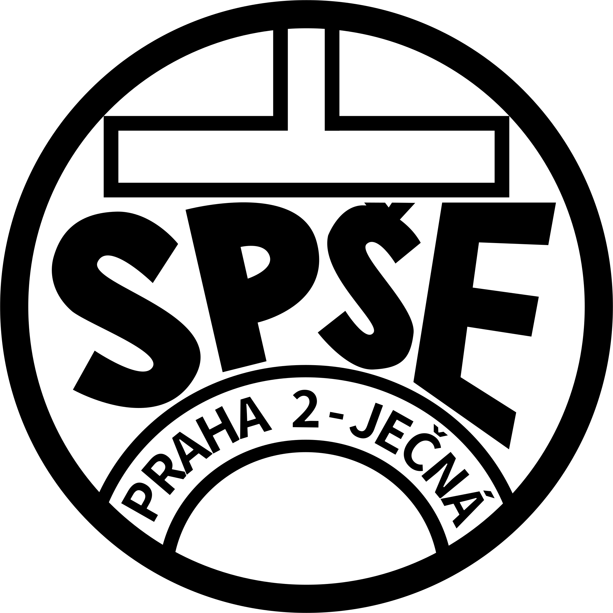
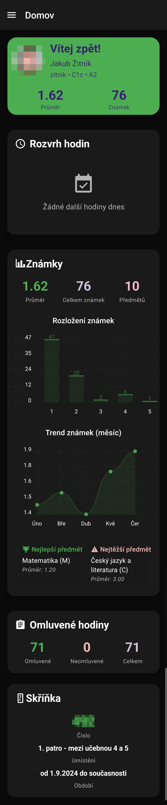
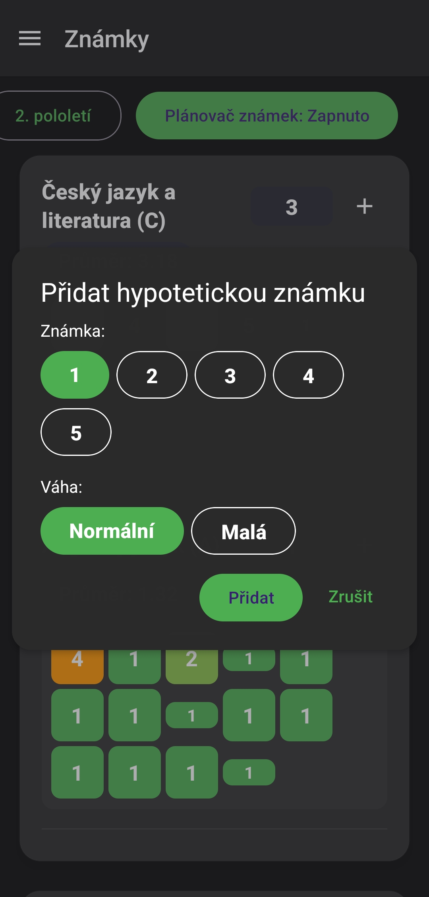
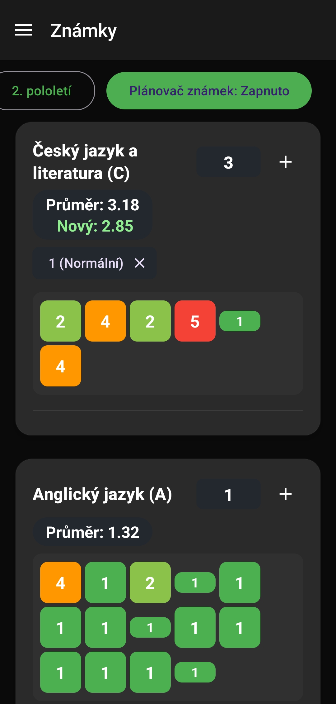
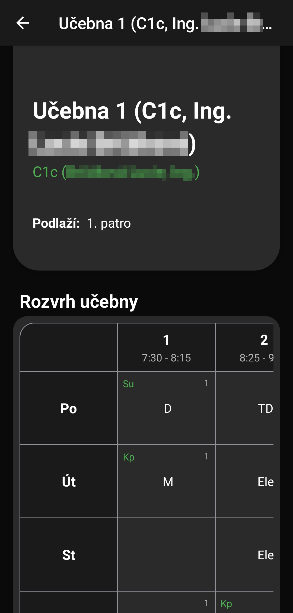
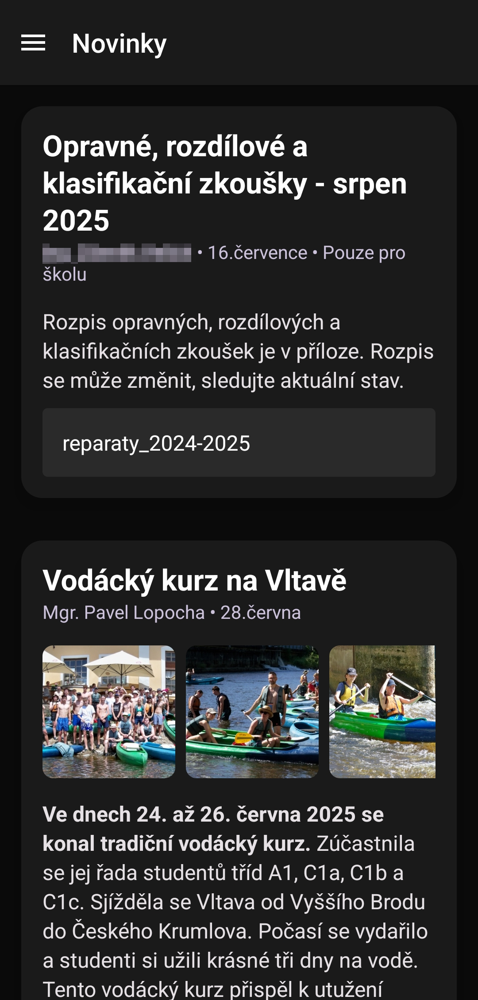
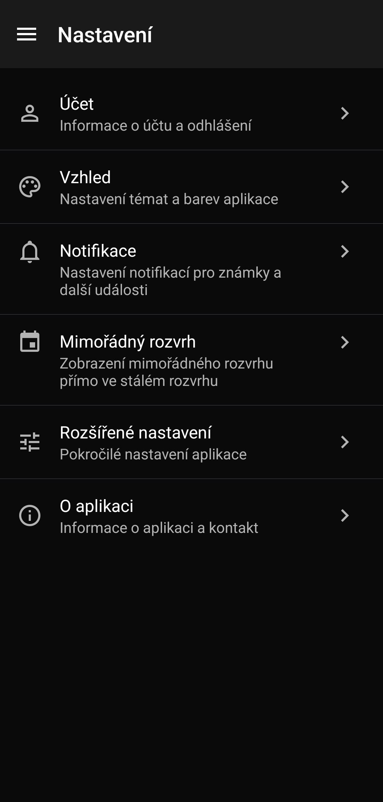

  

<h1 align="center">Ječná App</h1>

<b>Neoficiální mobilní aplikace pro studenty SPŠE Ječná</b>

  Rychlý přístup k rozvrhu, známkám, učitelům, jídelníčku a dalším školním informacím. 
  Vše v moderním, jednoduchém a přehledném rozhraní.

<b>Tato aplikace je neoficiální. Nemá nic společného s SPŠE Ječná a není schválena vedením školy.</b>

---

## Screenshoty

| Domovská obrazovka | Přidat hypotetickou známku | Známky |
|--------------------|--------|----------------|
|  |  |  |

| Učebna | Novinky | Nastavení |
|--------|---------|------------|
|  |  |  |

---

## Funkce

- Zobrazení rozvrhu
- **Mimořádný rozvrh přímo ve stálém rozvrhu**
- Přehled známek a průměrů
- Plánovač známek
- Seznam učitelů a učeben
- Příchody a odchody
- Omluvný list
- Jídelníček
- Notifikace na nové známky
- Moderní design
- Podpora světlého/tmavého režimu a vlastních barev

---

## Instalace

### Android

📦 [Stáhněte si nejnovější APK z Releases](https://github.com/jzitnik-dev/jecnaapp/releases)

### iOS

Aplikace je technicky cross-platform, ale pro iOS není distribuovaná, protože:

- Apple vyžaduje placenou vývojářskou licenci (99 USD ročně), kterou si nemohu dovolit.
- Nemám zájem to momentálně řešit.

Pokud si ji ale někdo vykompiluje a signe sám, rád opravím případné chyby.

### Linux

Pokud někdo používá Linux na telefonu, klidně mi dejte vědět – přepíšu to celé do Rustu jen kvůli vám. *(možná)*

---

## Vývoj

**Aplikace je ve velmi rané fázi.**  
Neočekávejte, že vše bude fungovat bez problémů. Nemám přístup ke všem typům účtů na testování.

Chyby hlaste jako Issue. Ideálně přiložte logy aplikace.

---

### Neotestované funkce

- Důtky a napomenutí – nemám jak otestovat, nevím o lidech, kteří je mají.

### Známé chyby

- **Odhlašování**  
  Občas někoho odhlásí bez důvodu. Je to vzácné, ale zatím netuším proč.

---

## Licence

Projekt je licencován pod GNU General Public License v3.0.  
Podrobnosti najdeš v souboru [COPYING](COPYING).

---

## Přispívání

Uvítám jakékoli příspěvky, nápady nebo hlášení chyb.  
Podrobnosti najdeš v [CONTRIBUTING.md](CONTRIBUTING.md).

---

> *Tato aplikace není oficiálně spojena se SPŠE Ječná.*
