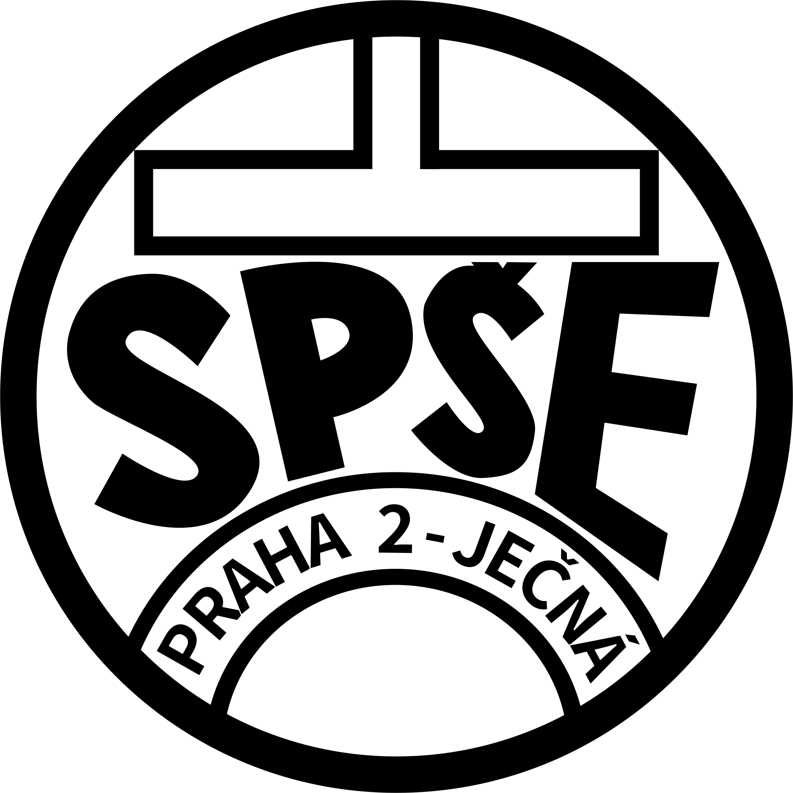
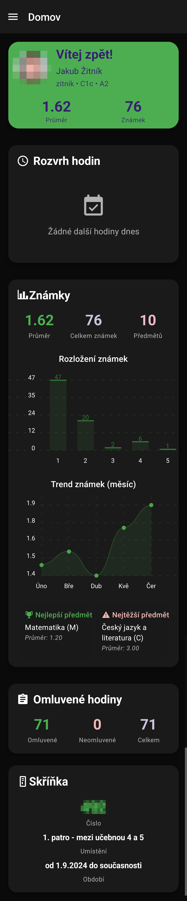
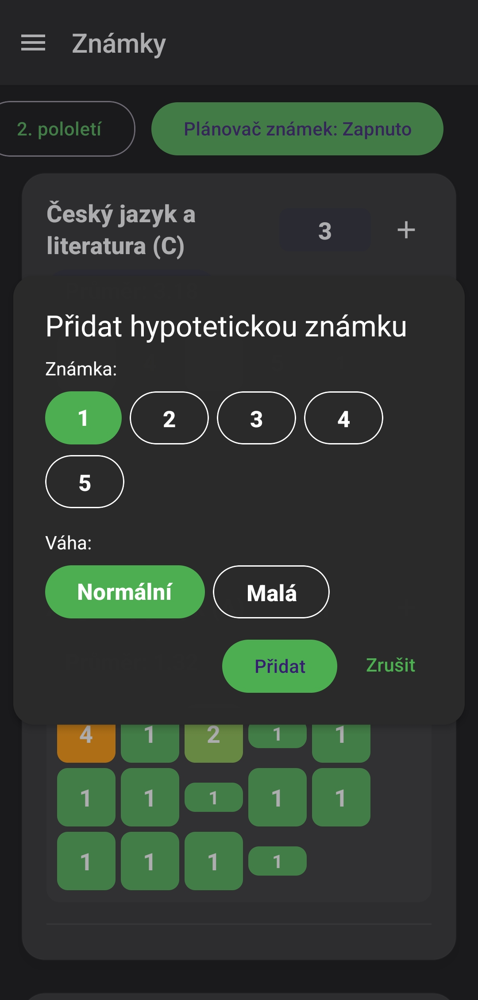
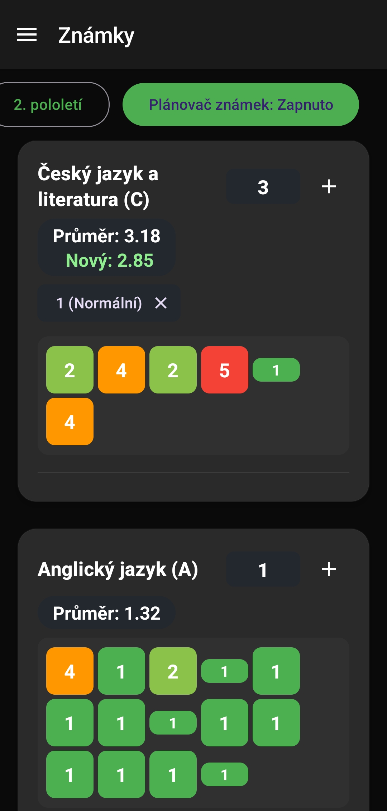
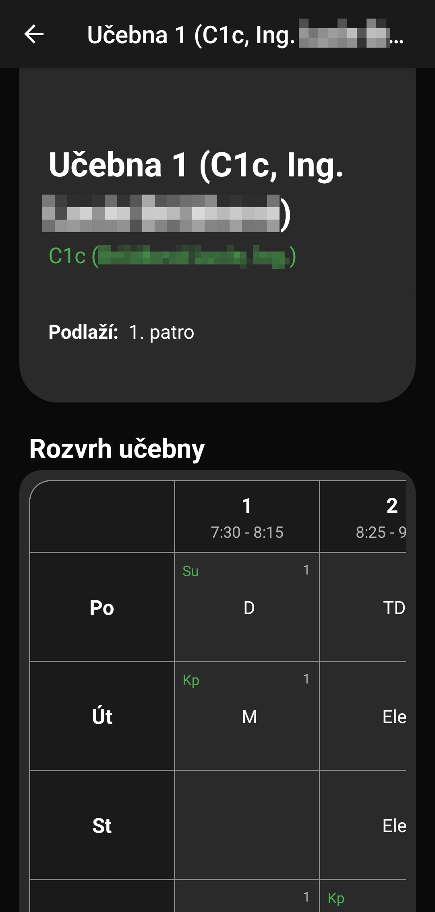
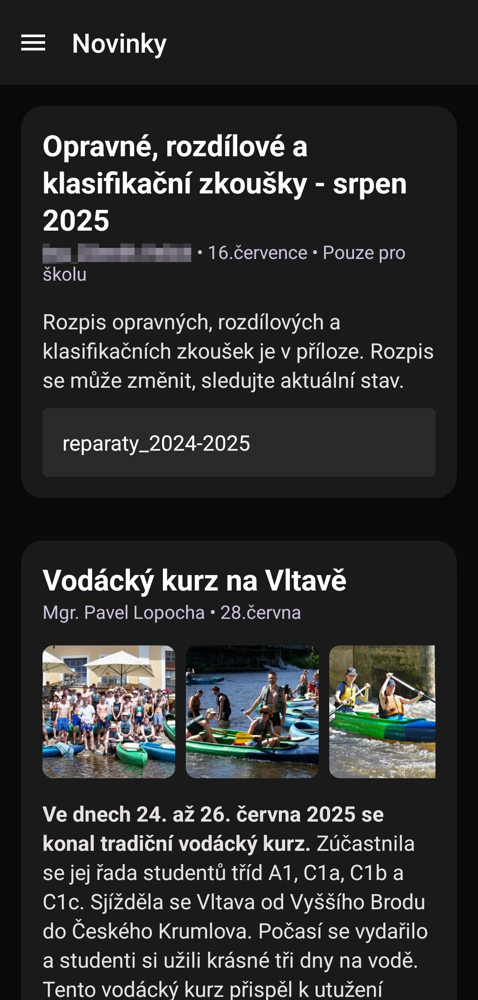
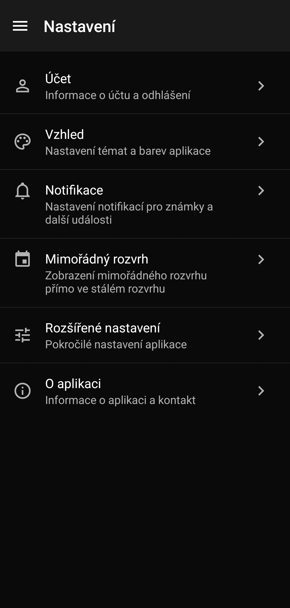

  

<h1 align="center">Ječná App</h1>

<b>Neoficiální cross-platform mobilní aplikace pro studenty SPŠE Ječná</b>

  Rychlý přístup k rozvrhu, známkám, učitelům, jídelníčku a dalším školním informacím. 
  Vše v moderním, jednoduchém a přehledném rozhraní.

<b>Tato aplikace je neoficiální. Nemá nic společného s SPŠE Ječná a není schválena vedením školy.</b>

---

## Screenshoty

| Domovská obrazovka | Přidat hypotetickou známku | Známky |
|--------------------|--------|----------------|
|  |  |  |

| Učebna | Novinky | Nastavení |
|--------|---------|------------|
|  |  |  |

---

## Hlavní výhody oproti Ječná Mobile

[Ječná Mobile](https://github.com/tomhula/JecnaMobile) je aktuálně lépe strukturovaná, více mature a hlavně optimalizovanější aplikace. Obě tyto aplikace sdílejí stejný scraper/API. Můj hlavní důvod k vývoji této aplikace je cross-platform podpora pro iOS. Přesto aplikace funguje i na Android. Obě aplikace mají de-facto stejné funkce a aktivně se podílím na vývoji i Ječná Mobile.

---

## Funkce

- Zobrazení rozvrhu
- **Mimořádný rozvrh přímo ve stálém rozvrhu**
- Přehled známek a průměrů
- Plánovač známek
- Seznam učitelů a učeben
- Příchody a odchody
- Omluvný list
- Jídelníček
- Notifikace na nové známky
- Moderní design
- Podpora světlého/tmavého režimu a vlastních barev

---

## Instalace

Více info na [jecnaapp.jzitnik.dev](https://jecnaapp.jzitnik.dev)

## Známé chyby

- **Widgety na iOS**  
  Widgety na iOS aktuálně často nefungují. Kdyby se někdo našel kdo umí dobře `expo-widgets` a nebo měl čas si pročíst dokumentaci a přepsat iOS widgety v této aplikaci, uvítám to. Klidně vytvořte PR, každá pomoc se cení.

---

## Licence

Projekt je licencován pod GNU General Public License v3.0.  
Podrobnosti najdeš v souboru [COPYING](COPYING).

---

## Přispívání

Uvítám jakékoli příspěvky, nápady nebo hlášení chyb.  
Podrobnosti najdeš v [CONTRIBUTING.md](CONTRIBUTING.md).

---

> *Tato aplikace není oficiálně spojena se SPŠE Ječná.*
